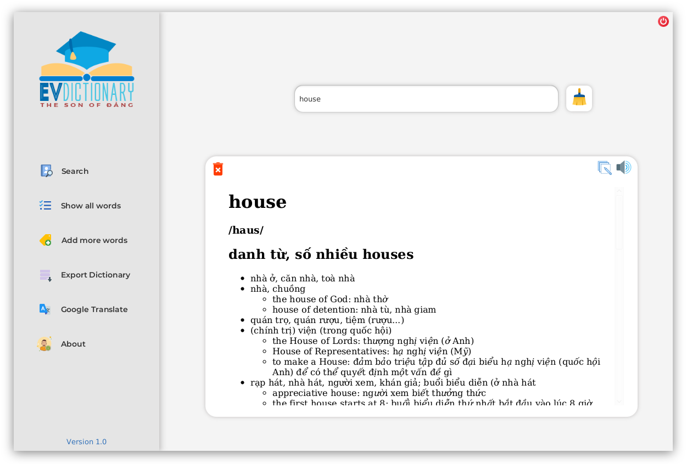

<p align="center">
  <a href="https://meokisama.github.io">
    
  </a>
</p>

<h1 align="center"> EVDictionary 📖 </h1>
<p align="center">
  <a href="https://github.com/meokisama/meokisama.github.io/blob/develop/LICENSE">
    
  </a>
  
  <a href="https://twitter.com/intent/follow?screen_name=meokiiii">
    
  </a>
</p>

## Description
A small Java project aims at providing a free (open source) English - Vietnamese dictionary 



## Information 🏷
- __IDE:__ _IntelliJ IDEA Ultimate Edition_
- __Project SDK:__ _Oracle OpenJDK 15.0.1_ 
- __Operating System:__ _Kali Linux 2020.4_

## Libraries
- __JavaFX 15__
    - https://openjfx.io/
- __JFoenix 9.0.10__
    - http://www.jfoenix.com/
- __SQLite JDBC 3.32.3.2__
    - https://github.com/xerial/sqlite-jdbc
- __JSON 20201115__
    - https://github.com/stleary/JSON-java
- __JL 1.0__
    - https://github.com/alex0107/Java-GoogleTTS

## Features
- Word searching
- Show all words
- Modify dictionary
- Translate by using Google API
- Text to speech
- Export database
## Setting environment
- Download all libraries above and add them to project modules path
- Configure VM Options
```
--module-path ${PATH_TO_FX} --add-modules javafx.controls,javafx.fxml,javafx.web
```
- Remember ```${PATH_TO_FX}``` is the path direct to your JavaFX __lib__ folder
## About words database
This databse contains over _109,000 words_.\
&nbsp;\
The raw format is __TXT__, and I have to convert it to SQLite databse using a GoLang application\
&nbsp;\
The application source code you can find in <a href = 'https://github.com/meokisama'>my Github repositories</a>.\
&nbsp;\
You can download the raw TXT file here: http://www.informatik.uni-leipzig.de/~duc/Dict/
## Find me around the web 🌎
<a href="https://facebook.com/slytherinnn/"></a>
- _Information in public on_ <a href="https://meokisama.github.io/">Blog</a> ✍🏾
- _Sharing updates on_ <a href="https://facebook.com/slytherinnn/">Facebook</a> 💼
- _Other products on_ <a href="https://www.behance.net/meokisama">Behance</a> 🏓
- _Daily photos on_ <a href="https://www.instagram.com/hi.im.meoki/">Instagram</a> 📷
- _"__Wibu__" collection on_ <a href="https://www.flickr.com/photos/meokisama/albums">Flickr</a> 👾
